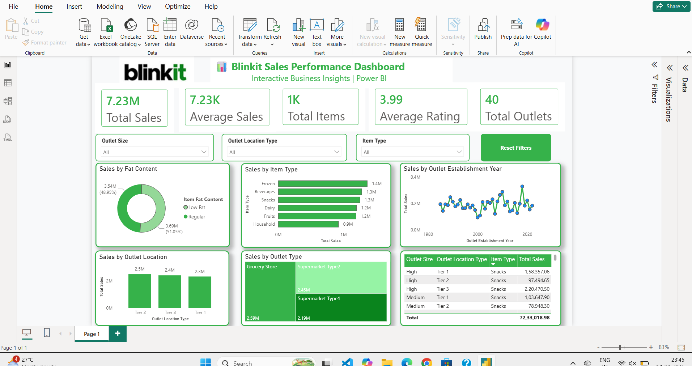

# Blinkit Sales Performance Dashboard 📊

An interactive sales analytics dashboard built using Microsoft Power BI to analyze Blinkit's sales performance across different outlet types, locations, item categories, and establishment years.

## 📌 Dashboard Overview

The dashboard provides insights into:

- Total Sales
- Average Sales
- Total Items
- Average Rating
- Total Outlets
- Sales by Item Type
- Sales by Fat Content
- Sales by Outlet Location
- Sales by Outlet Type
- Sales by Outlet Establishment Year

## 🛠️ Tools & Technologies

- Microsoft Power BI
- DAX
- Data Visualization
- Data Analysis

## ✨ Features

- Interactive slicers
- Reset Filters button
- KPI cards
- Interactive charts
- Business-focused visualizations

## 📷 Dashboard Preview

## 🎯 Key Skills Demonstrated

- Data Cleaning
- Data Modeling
- DAX Measures
- KPI Development
- Data Visualization
- Dashboard Design
- Business Insights
